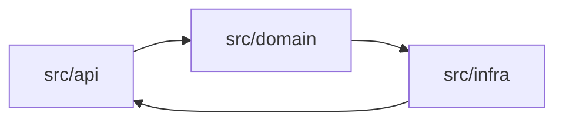
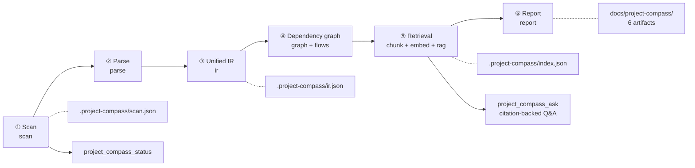

**English** | [中文](README.zh-CN.md)


# dsh-project-compass · Project Compass 项目罗盘

**Codebase reconnaissance and citation-backed Q&A for DeepSeek Harness.**

**Project Compass reads an existing project and turns "how is this thing put together" into a set of evidence-cited documents, plus a question-answering interface you can keep asking.**

It does not require you to get the project running first, does not require you to read all the code, and does not go online.
Give it a path and it returns six artifacts: an onboarding guide, an architecture description, a module map,
the key flows, the steps to get it running, and a machine-readable JSON.

---

> **Documentation language.** The detailed documents under `docs/` — [TOOLS](docs/TOOLS.md), [CONFIG](docs/CONFIG.md),
> [OUTPUT-FORMAT](docs/OUTPUT-FORMAT.md), [ARCHITECTURE](docs/ARCHITECTURE.md), [ROADMAP](docs/ROADMAP.md) and
> [VERIFICATION](docs/VERIFICATION.md) — are currently written in Chinese. If you need English versions,
> please raise it in an [issue](https://github.com/lpeixin/dsh-project-compass/issues).

---

## Table of contents

- [What problem it solves](#what-problem-it-solves)
- [Output artifacts](#output-artifacts)
- [Capability matrix](#capability-matrix)
- [Installation](#installation)
- [Quick start](#quick-start)
- [Configuration](#configuration)
- [Tools and command reference](#tools-and-command-reference)
- [How it works: the six-step pipeline](#how-it-works-the-six-step-pipeline)
- [Privacy and security](#privacy-and-security)
- [How it integrates with DSH](#how-it-integrates-with-dsh)
- [Development and testing](#development-and-testing)
- [License](#license)

---

## What problem it solves

When you take over an unfamiliar codebase, the expensive part is not reading code — it is **not knowing where to
start reading, and not knowing what will break when you change something.**

| Situation | What it used to cost | What Project Compass gives you |
| --- | --- | --- |
| **New developer onboarding** | A colleague explains verbally for two hours, and afterwards you still don't know where the entry point is; the README was last updated three years ago | `GETTING_STARTED.md` gives runnable steps to get up and running, `ONBOARDING.md` gives a reading order arranged by role, and every item carries `path:line` so you can jump straight into the code |
| **Inheriting a legacy project** | No documentation, the original owner has left, and changing one line feels like a three-day risk | `ARCHITECTURE.md` + `MODULE_MAP.md` give module boundaries, dependency direction, cycles and high-risk modules; risks come with reasons, not with feelings |
| **A tech lead reviewing a change** | "How big is the blast radius of this change?" can only be guessed from experience | A module / file / symbol three-level dependency graph plus reachability from entry points, so blast radius is something you look at rather than guess at; key flows come with Mermaid sequence diagrams |
| **An AI agent that needs project context** | Every turn re-greps, the context fills up with scattered fragments, and it still invents files that do not exist | `project_compass_ask` returns answers with `citations` (`path:line` + symbol + rationale); every claim passes a validator first — paths, line numbers and symbols must really exist, and claims that fail validation are explicitly dropped and counted |

In one sentence: **it turns "understanding a project" from oral tradition into an artifact that is reproducible,
reviewable and diffable.**

---

## Output artifacts

`project_compass_report` generates 6 artifacts in one pass, written by default to `<project>/docs/project-compass/`:

| Artifact | Audience | Content |
| --- | --- | --- |
| `ONBOARDING.md` | Newcomers / people taking over | Project overview, reading routes and checklists by role (backend / frontend / test / devops / data), terminology and conventions, common pitfalls |
| `ARCHITECTURE.md` | Tech leads / architecture review | Module layering diagram (Mermaid), dependency direction, cycles, hub modules, high-risk modules with the reasons behind their scores |
| `MODULE_MAP.md` | All developers | Per-module responsibility, file list, lines of code, public surface, dependencies and dependents, risk level |
| `KEY_FLOWS.md` | Debugging / change assessment | Key flows starting from HTTP routes, CLI entry points and event entry points, step by step + Mermaid sequence diagrams + evidence |
| `GETTING_STARTED.md` | Everyone | Environment requirements, install / build / test / start commands (with the source of each command), common failures and how to diagnose them |
| `project-compass.json` | CI / other tooling | An IR summary view: modules, dependencies, routes, risks, statistics and metadata, with a `schemaVersion` for programmatic consumption |

> **This repository does not commit its own generated artifacts.** `docs/project-compass/` is ignored via
> [`.gitignore`](.gitignore): the reports are generated output, they go stale the moment the code changes, and they
> weigh close to 500 KB — while being trivially reproducible. To generate the example yourself, run:
>
> ```bash
> node scripts/compass-cli.mjs analyze . && node scripts/compass-cli.mjs report .
> ```

> The excerpts below are **illustrative excerpts (not real output)**, meant to show what the artifacts look like and
> how specific the format is. The actual content is determined by your own scan of your own project.
> (Reports are currently rendered in Chinese; the excerpts keep that real format.)

```markdown
<!-- Illustrative excerpt (not real output): ONBOARDING.md fragment -->
# ONBOARDING · example-shop 上手报告

> **生成时间**：2026-10-02T09:12:44.108Z ｜ **项目**：`example-shop` ｜ **工具版本**：dsh-project-compass@0.1.0
> **证据口径**：所有结论均标注静态证据：`path:line` 或 `path#symbol`；……无证据的推断显式标注"未验证"。
> **LLM 参与**：否 —— 本报告全部结论来自静态证据，未调用 LLM

## 6. 按角色阅读路线

| 角色 | 关注点 | 推荐阅读路线 | 检查清单 |
| --- | --- | --- | --- |
| 后端 | HTTP/CLI 入口、路由与处理函数、服务与数据访问层 | 1. 阅读入口（http-server）（`src/server.ts:24`）<br>2. 路由集中模块 src/api（12 条路由）（`src/api/orders.ts:41`） | - 确认全部 HTTP 路由与中间件（IR 记录 26 条）<br>- 确认模块依赖方向单一、无环 |
```

````markdown
<!-- Illustrative excerpt (not real output): ARCHITECTURE.md fragment -->
# ARCHITECTURE · example-shop 架构说明

## 1. 分层架构总览



## 4. 循环依赖与高风险模块

- 循环依赖：`src/api` → `src/domain` → `src/infra` → `src/api`
  证据：`src/api/orders.ts:5`、`src/domain/order.ts:2`、`src/infra/db.ts:3`
- 高风险模块：`src/infra`（评分 72；理由：fanIn=11、被 4 个模块依赖、位于循环依赖中）
````

```jsonc
// Illustrative excerpt (not real output): project-compass.json fragment
{
  "schemaVersion": 1,
  "generatedAt": "2026-10-02T09:12:44.108Z",
  "tool": { "name": "dsh-project-compass", "version": "0.1.0" },
  "project": {
    "name": "example-shop",
    "kinds": ["api-service"],
    "size": { "files": 213, "sourceFiles": 198, "modules": 14, "symbols": 1480, "routes": 26, "flows": 9 }
  },
  "graph": {
    "hubs": [{ "id": "src/infra", "fanIn": 11, "fanOut": 2 }],
    "cycles": [["src/api", "src/domain", "src/infra"]],
    "riskModules": [{ "id": "src/infra", "score": 72, "reasons": ["fanIn=11", "位于循环依赖中"] }]
  },
  "risks": { "count": 3, "signals": { "todoCount": 17 } },
  "evidence": { "validation": { "droppedCount": 0 }, "warnings": [] }
}
```

> All three excerpts above are **illustrative** (the structure matches the real artifacts, the numbers and content
> have nothing to do with any real project); they exist to show what the artifacts look like and how specific the
> format is. The complete field reference is in [docs/OUTPUT-FORMAT.md](docs/OUTPUT-FORMAT.md).

---

## Capability matrix

The table below maps one-to-one onto the 12 functional requirements in the requirements document (FR1–FR12).
**This version still targets full FR1–FR12 coverage**, of which 10 items are fully implemented,
**1 is implemented in a way that differs from the requirement text (FR2)**, and
**1 is limited by host capability (streaming progress in FR10)** — the differences are stated in the table
rather than smoothed over.

| FR | Requirement | What this plugin actually does | Status |
| --- | --- | --- | --- |
| FR1 | Project scan: scan the root directory, apply ignore rules, identify languages, frameworks, entry points, configuration | Same, plus sensitive-file registration (path only, contents never read), risk signals and engineering gaps | Implemented in this version |
| FR2 | Multi-language AST parsing: parse TS/JS, Python, Java with Tree-sitter; extract symbols, imports, calls, routes | **Deviation**: Tree-sitter is not used (the host and the repository convention are zero external dependencies, so the dependency is not available); replaced by a purpose-built zero-dependency lexical / structural extractor. Language coverage is unchanged | Implemented in this version (**different implementation**) |
| FR3 | Unified IR: Project / Module / File / Symbol / Import / Call / Route | Same, and it carries `schemaVersion`, statistics, warnings and budget | Implemented in this version |
| FR4 | Dependency graph: module level, file level, symbol level | Same, plus fan-in/fan-out, hubs, orphans, entry-point reachability, cycle detection and risk scoring | Implemented in this version |
| FR5 | Incremental cache: content-hash-based caching of AST, IR, graph, summaries, embeddings | **Precise scope**: content-hash caching applies to per-file parse results; the IR and the graph are recomputed in memory from those cached results (milliseconds, hence not persisted); the retrieval index supports incremental updates for changed files | Implemented in this version (**see the note on cache granularity**) |
| FR6 | LLM summarization and validation: generate summaries from facts, validate entities, paths, line numbers | Same, off by default; every claim goes through the validator, and anything that fails is dropped and counted | Implemented in this version |
| FR7 | RAG index and Q&A: chunking, embeddings, hybrid retrieval, reranking, citation-backed answers | Same; embeddings are local deterministic vectors (no network, no model files) | Implemented in this version |
| FR8 | Report generation: Markdown + Mermaid + JSON | Same, producing 6 artifacts; plus per-role reading routes | Implemented in this version |
| FR9 | DSH tool registration: register analyze / report / ask / update / status tools and commands | Same; 6 tools in fact (including `project_compass_scan`) + the `/compass` command + an embedded methodology skill | Implemented in this version |
| FR10 | Configuration and progress: configuration, budget, concurrency, ignore rules, streaming progress | Configuration / budget / concurrency / ignore rules are all implemented; `analyze` already has an internal `onProgress({phase,done,total,message})` callback. **Streaming progress is limited by host capability**: `ToolDefinition` provides no progress channel at all (only `deferContext` / `concludeTurn`), and the event table has no emittable event such as `tool/progress`, so the plugin side cannot surface in-flight progress to the GUI | **Partially implemented (host limitation, not an implementation gap)** |
| FR11 | Multi-role reports: reading routes for backend / frontend / test / devops | Same; in fact five roles — backend / frontend / test / devops / data — derived from IR evidence, with roles that have no evidence stated as such | Implemented in this version |
| FR12 | Security and privacy: ignore sensitive files, local first, cloud LLM requires confirmation | Same: sensitive files are never read, nothing goes online by default, and the LLM must be explicitly enabled and consented to | Implemented in this version |

On the FR5 cache scope: what lands on disk under `.project-compass/cache/` is the **per-file parse result**
(keyed by content hash); the IR and the dependency graph are rebuilt in memory from those results — both are pure
computation on the millisecond scale, so they are not persisted separately, which avoids several derived artifacts
drifting out of sync with each other.

A few capabilities are not numbered separately in the requirements document but are implemented in this version
all the same: **key-flow extraction** starting from routes / CLI / event entry points (step-by-step plus Mermaid
sequence diagrams and confidence), and the in-repo `scripts/compass-cli.mjs` self-test channel — both belong to
the graph analysis and tool registration in the table above, and do not take a separate number.

Design discipline (written into the contract and into code review): **better to under-report than to misreport.**
Line numbers, symbols and paths must be checkable in the IR; conclusions that cannot be checked either do not make
it into the report or are explicitly marked "unverified".

### Two adjustments to §5 of the requirements document ("plugin integration design")

The skeleton given by the requirements document is TypeScript + `inject = ['fs','llm','tools','logger','storage','workspace']`.
Under the authorization of that section's final clause — "adjust the integration code to the actual DSH plugin API,
abstracting an adapter layer where necessary" — this implementation makes two adjustments and states them here:

1. **Zero-dependency ESM JavaScript, not TypeScript + npm dependencies.** Reason: the host runtime does not provide
   dependencies such as Tree-sitter, and the convention of the existing plugin in this repository (`dsh-qualityforge`)
   is to "import `node:*` only" — this way there is no build step, and loading cannot fail because of how the
   `@deepseek-ai/*` packages inside the host are resolved or because of a version change.
2. **`inject` declares only the real hard dependency, `tools`**; the other services are probed as optional
   capabilities: `ctx.get('commands')` (the `/compass` command), `ctx.get('skills')` (the methodology skill),
   `ctx.get('systemPrompt')` (optional context injection), `ctx.get('llm')` + `agentDefaultModel` (optional narrative
   enhancement). When any of these services is missing the plugin **degrades silently** rather than failing to load —
   it should be usable in any combination.

---

## Installation

### Requirements

| Item | Requirement |
| --- | --- |
| Node.js | ≥ 20.11 (built-in `node:test` / `TextDecoder` / `fs/promises`) |
| DSH | Any version that supports Cordis plugins and the `dsh.bundle.patch` contract |
| Dependencies | None. This plugin has zero external dependencies: clone it and it runs, with no build step |

### Install through the plugin manager

In the GUI, ask the agent to run `install_bundle` with this spec:

```text
file:/absolute/path/to/dsh-project-compass
```

This writes the bundle and the dependency into the profile's `bundles` / `dependencies`.

> The path is installed by pnpm as a **`file:` dependency**. If your package manager materializes it as hard links,
> the installed copy can still hold the old content after repository files are replaced by "write + rename" —
> after changing code, reinstall once to be sure.

### Manual install for local development (symlink the repository into the profile)

```bash
ln -s "$PWD" ~/.dsh/profiles/desktop/node_modules/dsh-project-compass
```

> `desktop` is the profile name; substitute the profile you actually use. On Windows, use `mklink /D` or copy the
> directory instead.

Then append to `~/.dsh/profiles/desktop/cordis.patch.yml`:

```yaml
- insert:
    - id: project-compass
      name: 'dsh-project-compass'
```

Restart or reload DSH and run `/compass status` in a session; if it lists a status, the installation works.

### Temporarily disabling it (without uninstalling)

```yaml
- id: project-compass
  disabled: true
```

### In-repo self-test (no DSH required)

This plugin ships a command-line channel that does not depend on the host process, so every capability can be run in
a plain Node environment:

```bash
node --test                                                    # unit tests (all green means pass)
node scripts/compass-cli.mjs analyze <path/to/project>          # scan + parse + IR + dependency graph
node scripts/compass-cli.mjs report  <path/to/project>          # generate the 6 artifacts
node scripts/compass-cli.mjs ask     <path/to/project> "登录流程经过哪些模块？"
node scripts/compass-cli.mjs status  <path/to/project>          # current status and cache size
```

Replace `<path/to/project>` with the absolute path of any real project. All of this only reads your project's source
code; writes happen only inside that project's `.project-compass/` and `docs/project-compass/`.

> `scripts/compass-cli.mjs` is the in-repo self-test entry point and the channel used by CI and regression runs.
> It goes through **the same implementation path** as the DSH tools (`lib/pipeline.js`); the only difference is that
> it does not pass through the host, so the `llm.*` enhancements are unavailable (degrading as "no LLM service in
> the host").

---

## Quick start

Inside a DSH session (with the working directory set to the target project):

```text
/compass analyze      # reconnaissance + parse + build IR + build dependency graph (first run; incremental afterwards)
/compass report       # generate the 6 artifacts into docs/project-compass/
/compass ask 登录流程经过哪些模块？   # citation-backed Q&A, every claim carries path:line
/compass status       # see whether it is analyzed, artifact paths, cache size, suggested next step
```

You can also skip the commands entirely and just tell the agent:

> Use Project Compass to analyze the current project, generate the onboarding docs, then tell me which modules the
> authentication flow goes through.

The agent will call these 6 tools as needed:

```text
project_compass_scan     → reconnaissance: directories, languages, entry points, commands, sensitive files, risk signals
project_compass_analyze  → parse + IR + dependency graph (supports incremental / budget / concurrency)
project_compass_report   → generate the 6 artifacts
project_compass_ask      → citation-backed Q&A (local retrieval, no LLM by default)
project_compass_update   → recompute only changed files, refresh IR / index / report
project_compass_status   → current status and suggested next step
```

The typical rhythm: **`analyze` → `report` the first time; `update` after each change; `ask` whenever a question
comes up.**

---

## Configuration

Configuration lives in the profile's `cordis.patch.yml`, addressed by the id `project-compass`:

```yaml
- id: project-compass
  name: dsh-project-compass
  config:
    outputDir: docs/project-compass
    concurrency: 8
    budget:
      maxFiles: 20000
      maxFileBytes: 262144
      maxTotalBytes: 67108864
      maxDurationMs: 600000
      maxChunks: 20000
    ignore: []
    include: []
    sensitive:
      extraPatterns: []
    llm:
      enabled: false
    contextInjection: false
```

| Key | Default | Effect |
| --- | --- | --- |
| `outputDir` | `docs/project-compass` | Output directory for the human artifacts (relative to the project root) |
| `concurrency` | `8` | Parse concurrency; raise it for IO-bound workloads, lower it on spinning disks or when there are many very large files |
| `budget.*` | see above | Caps on file count / per-file bytes / total bytes / duration / chunk count; exceeding them truncates and tags the result |
| `ignore` / `include` | `[]` | Additional ignore rules (`.gitignore` syntax, `!` negation supported) and force-include rules |
| `sensitive.extraPatterns` | `[]` | Additional sensitive-file patterns; matching paths are registered only and their contents are never read |
| `llm.enabled` | `false` | Whether the LLM may be called to generate narrative (does not change retrieval or fact extraction) |
| `contextInjection` | `false` | Whether to inject a project brief into the agent's system prompt |

Per-key details, matching semantics, the default sensitive-file list, tuning for large repos / monorepos and the LLM
privacy notes are in **[docs/CONFIG.md](docs/CONFIG.md)**.

> Project-level configuration (letting a repository carry its own preferences) is out of scope for this version;
> see [docs/ROADMAP.md](docs/ROADMAP.md).

---

## Tools and command reference

### Command: `/compass`

| Subcommand | Equivalent tool | Description |
| --- | --- | --- |
| `/compass analyze` | `project_compass_analyze` | Full or incremental analysis, producing the IR |
| `/compass report` | `project_compass_report` | Generate the 6 artifacts |
| `/compass ask <question>` | `project_compass_ask` | Citation-backed Q&A |
| `/compass update` | `project_compass_update` | Incremental update |
| `/compass status` | `project_compass_status` | Show status |
| `/compass help` | — | Quick usage reference |

### Tools

| Tool | In one line | Main parameters | Artifacts |
| --- | --- | --- | --- |
| `project_compass_scan` | Reconnoiter the project: languages / frameworks / entry points / commands / sensitive files / gaps | `projectPath` | `.project-compass/scan.json` |
| `project_compass_analyze` | Scan + parse + unified IR + three-level dependency graph | `projectPath`, `force`, `withLlm`, `maxFiles` | `.project-compass/ir.json` |
| `project_compass_report` | Generate the 6 artifacts (with Mermaid diagrams and role routes) | `projectPath`, `withLlm` | 6 files under `docs/project-compass/` |
| `project_compass_ask` | Project-level citation-backed Q&A (local retrieval, extractive by default) | `projectPath`, `question` | Returns `citations` and a confidence level; the Q&A log is kept locally |
| `project_compass_update` | Recompute only changed files, refresh IR / index / report | `projectPath` | Refreshes the artifacts above |
| `project_compass_status` | Whether it is analyzed, artifact paths, cache size, last budget, suggested next step | `projectPath` | Returns status only, writes nothing |

The full parameter tables (name / type / required / default / description), the returned fields, typical call
sequences and degradation behavior are in **[docs/TOOLS.md](docs/TOOLS.md)**; artifact structure, the citation format
and the JSON field tables are in **[docs/OUTPUT-FORMAT.md](docs/OUTPUT-FORMAT.md)**.

---

## How it works: the six-step pipeline



| Step | What it does | Key trade-off |
| --- | --- | --- |
| ① Scan | Directory traversal, ignore rules, language and framework detection, entry-point and command discovery, sensitive-file registration, risk signals and engineering gaps | Only `stat` sensitive paths, never read them; conclusions come from on-disk evidence, not guesses |
| ② Parse | Dispatch parsers by language; extract symbols / imports / calls / routes / TODOs with line numbers and ranges | Line/column scanning plus bracket / indentation balancing, no tree-sitter, staying zero-dependency; cross-file resolution is left to the IR layer |
| ③ Unified IR | Converge the multi-language results into one shape, resolve import specifiers to fileIds, bind calls | Call binding has only four possible conclusions and must record its `resolution`; when it cannot be determined it stays `unresolved`, without guessing |
| ④ Dependency graph and flows | Build the module / file / symbol three-level graph, compute fan-in/fan-out, cycles, reachability and risk; extract key flows from entries | Entirely deterministic algorithms: the same input necessarily yields the same output, which makes diffing and caching possible |
| ⑤ Retrieval | Chunking + local deterministic vectors + BM25 → RRF fusion → reranking | The vectors are hashed word vectors plus character trigrams, so no model files and no network are needed — hence reproducible and offline |
| ⑥ Report | Render the 6 artifacts: Markdown + Mermaid + evidence citations + role routes | Every conclusion carries `path:line`; unverifiable inferences are explicitly marked "unverified"; the LLM only writes narrative and must pass validation |

**Where incrementality comes from**: every file enters the cache keyed by its content hash. `update` recomputes only
the files whose hash changed; unchanged files reuse their parse results and index entries directly. So the cost of
the second and later analyses is roughly proportional to "how much you changed" rather than to the size of the
repository.

---

## Privacy and security

| Boundary | How it is handled |
| --- | --- |
| **Local first** | Scanning, parsing, retrieval and Q&A all happen on your machine; the plugin itself **makes no network requests** |
| **Sensitive files are never read** | When `.env`, private keys, credential files and the like match a sensitive rule, only a `stat` is done to register the path and kind; the contents never enter memory, cache or reports |
| **LLM off by default** | `llm.enabled: false` is the default. Unless you turn it on explicitly, no code fragment is ever sent to a model |
| **When the LLM is on** | Only the minimal context needed to generate narrative is sent; the response goes through the validator first (paths / line numbers / symbols must really exist), failing claims are dropped and counted, and the report states how many were dropped |
| **Write scope** | Only the target project's `.project-compass/` (machine state) and `docs/project-compass/` (human artifacts); no business code is ever modified |
| **Zero dependency surface** | No npm dependencies, no install scripts, no build output, so there is no supply-chain surface to introduce |

**The machine-state directory ignores itself.** On first write the plugin drops a `.gitignore` whose rule is `*` into
`<project>/.project-compass/`, because `scan.json` / `ir.json` / `state.json` record the **absolute project root** —
that is, your local filesystem layout. `git add .` therefore does not commit it even if you have configured nothing.
Delete that file if you deliberately want to version the state. It is only written when missing, so it never
overwrites content of your own.

The full explanation and the vulnerability reporting process are in **[SECURITY.md](SECURITY.md)**.

---

## How it integrates with DSH

- **6 tools** are exposed to the model through Cordis tool registration, with the model-visible names uniformly
  `project_compass_*`;
- **1 command**, `/compass`, is exposed to humans, its subcommands passing straight through to the corresponding tools;
- **The plugin entry** has only named exports (`name` / `inject` / `apply`) and no default export;
- **Host services** are reached only through `ctx.get(...)` (such as the session default model or the LLM service);
  when they are unavailable, the plugin degrades to deterministic output;
- **`contextInjection`** (default `false`), when enabled, injects a brief about the analyzed project into the agent's
  system prompt, so that later answers in the same session already carry the project context; when disabled,
  everything is triggered on demand.

---

## Development and testing

```bash
node --test                                             # unit tests, must be all green
node --test --experimental-test-coverage                # coverage
node scripts/compass-cli.mjs analyze <path/to/project>  # smoke test against a real project
```

Hard engineering constraints (read [docs/INTERNAL-CONTRACTS.md](docs/INTERNAL-CONTRACTS.md) before changing code):

1. **Zero external dependencies**: only `node:*` built-in modules are allowed;
2. **Pure ESM**: `"type": "module"`, and relative imports must carry the `.js` suffix;
3. **No default export**: the entry point may only use the named exports `name` / `inject` / `apply`;
4. **Fault tolerance first**: parsers, retrievers and report renderers do not throw on malformed input — they
   degrade and write `warnings`;
5. **Do not touch the contract**: `docs/INTERNAL-CONTRACTS.md` is the single source of truth for interfaces during
   parallel development; changing the contract means changing it first.

Architecture, module layering and extension points are in [docs/ARCHITECTURE.md](docs/ARCHITECTURE.md); how to
contribute is in [CONTRIBUTING.md](CONTRIBUTING.md); the change history is in [CHANGELOG.md](CHANGELOG.md).

---

## License

[MIT](LICENSE)
