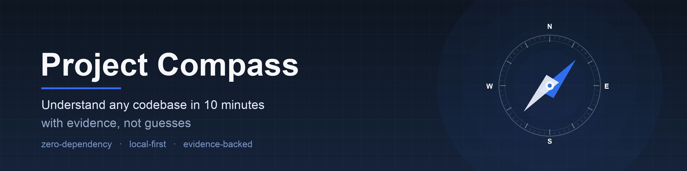
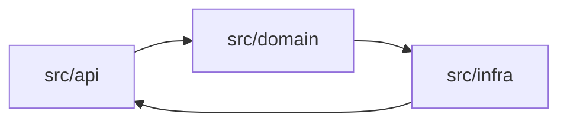
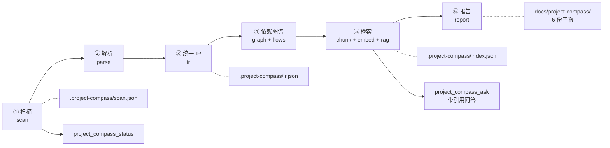

[English](README.md) | **中文**



# dsh-project-compass · 项目罗盘

**面向 DeepSeek Harness 的代码库侦察与带引用问答插件。**

**项目罗盘（Project Compass）读取一个已经存在的项目，把「它是怎么搭起来的」变成一组带证据引用的文档和一次可追问的问答。**

它不要求你先把项目跑起来，不要求你读完所有代码，也不联网。给它一个路径，它还你六份产物：
一份上手指南、一份架构说明、一份模块地图、一条关键链路、一份跑起来的步骤，和一份机器可读的 JSON。

---

## 目录

- [它解决什么问题](#它解决什么问题)
- [输出成果](#输出成果)
- [能力矩阵](#能力矩阵)
- [安装](#安装)
- [快速开始](#快速开始)
- [配置](#配置)
- [工具与命令参考](#工具与命令参考)
- [原理：六步流水线](#原理六步流水线)
- [隐私与安全](#隐私与安全)
- [与 DSH 的集成方式](#与-dsh-的集成方式)
- [开发与测试](#开发与测试)
- [许可证](#许可证)

---

## 它解决什么问题

接手一个陌生代码库时，真正贵的不是读代码，而是**不知道先读哪里、不知道改哪里会炸**。

| 场景 | 以前的成本 | 项目罗盘给什么 |
| --- | --- | --- |
| **新开发者入职** | 老同事口头讲两小时，讲完还是不知道入口在哪；README 停留在三年前 | `GETTING_STARTED.md` 给出可执行的跑通步骤，`ONBOARDING.md` 给出按角色排好的阅读顺序，每条都带 `path:line`，可以顺着点进代码 |
| **接手遗留项目** | 没有文档、原负责人已离职，改一行要怕三天 | `ARCHITECTURE.md` + `MODULE_MAP.md` 给出模块边界、依赖方向、循环依赖与高风险模块，风险有理由而不是感觉 |
| **技术负责人做评审** | 「这个改动影响面多大」只能靠经验猜 | 模块 / 文件 / 符号三级依赖图 + 从入口出发的可达性，影响面可以看而不是猜；关键链路有 Mermaid 时序图 |
| **AI Agent 需要项目上下文** | 每轮对话重新 grep，上下文被零散片段塞满，还容易编造不存在的文件 | `project_compass_ask` 返回带 `citations`（`path:line` + 符号 + 依据）的答案，所有结论先过验证器：路径、行号、符号必须真实存在，验证不过的声明显式丢弃并计入丢弃条数 |

一句话：**它把「读懂一个项目」从口头传承变成可复现、可评审、可 diff 的产物。**

---

## 输出成果

`project_compass_report` 一次生成 6 份产物，默认写入 `<项目>/docs/project-compass/`：

| 产物 | 给谁看 | 内容 |
| --- | --- | --- |
| `ONBOARDING.md` | 新人 / 接手者 | 项目速览、按角色（backend / frontend / test / devops / data）的阅读路线与清单、术语与约定、常见陷阱 |
| `ARCHITECTURE.md` | 技术负责人 / 架构评审 | 模块分层图（Mermaid）、依赖方向、循环依赖、枢纽模块、高风险模块及评分理由 |
| `MODULE_MAP.md` | 所有开发者 | 每个模块的职责、文件清单、代码行数、对外接口、依赖与被依赖、风险等级 |
| `KEY_FLOWS.md` | 排障 / 改动评估 | 从 HTTP 路由、CLI 入口、事件入口出发的关键链路，逐步步骤 + Mermaid 时序图 + 证据 |
| `GETTING_STARTED.md` | 任何人 | 环境要求、安装 / 构建 / 测试 / 启动命令（含命令来源）、常见失败与排查 |
| `project-compass.json` | CI / 其他工具 | IR 摘要视图：模块、依赖、路由、风险、统计与元信息，`schemaVersion` 可编程消费 |

> **本仓库不提交自己生成的产物。** `docs/project-compass/` 已在 [`.gitignore`](.gitignore) 中被忽略：
> 它是生成物，代码一变就会过期，体积近 500KB，却可以随时重建。要自己生成示例，运行：
>
> ```bash
> node scripts/compass-cli.mjs analyze . && node scripts/compass-cli.mjs report .
> ```

> 下面是**示意摘录（非真实输出）**，用于说明产物长什么样、格式有多具体。
> 实际内容由你对项目的一次扫描决定。

```markdown
<!-- 示意摘录（非真实输出）：ONBOARDING.md 片段 -->
# ONBOARDING · example-shop 上手报告

> **生成时间**：2026-10-02T09:12:44.108Z ｜ **项目**：`example-shop` ｜ **工具版本**：dsh-project-compass@0.1.0
> **证据口径**：所有结论均标注静态证据：`path:line` 或 `path#symbol`；……无证据的推断显式标注"未验证"。
> **LLM 参与**：否 —— 本报告全部结论来自静态证据，未调用 LLM

## 6. 按角色阅读路线

| 角色 | 关注点 | 推荐阅读路线 | 检查清单 |
| --- | --- | --- | --- |
| 后端 | HTTP/CLI 入口、路由与处理函数、服务与数据访问层 | 1. 阅读入口（http-server）（`src/server.ts:24`）<br>2. 路由集中模块 src/api（12 条路由）（`src/api/orders.ts:41`） | - 确认全部 HTTP 路由与中间件（IR 记录 26 条）<br>- 确认模块依赖方向单一、无环 |
```

````markdown
<!-- 示意摘录（非真实输出）：ARCHITECTURE.md 片段 -->
# ARCHITECTURE · example-shop 架构说明

## 1. 分层架构总览



## 4. 循环依赖与高风险模块

- 循环依赖：`src/api` → `src/domain` → `src/infra` → `src/api`
  证据：`src/api/orders.ts:5`、`src/domain/order.ts:2`、`src/infra/db.ts:3`
- 高风险模块：`src/infra`（评分 72；理由：fanIn=11、被 4 个模块依赖、位于循环依赖中）
````

```jsonc
// 示意摘录（非真实输出）：project-compass.json 片段
{
  "schemaVersion": 1,
  "generatedAt": "2026-10-02T09:12:44.108Z",
  "tool": { "name": "dsh-project-compass", "version": "0.1.0" },
  "project": {
    "name": "example-shop",
    "kinds": ["api-service"],
    "size": { "files": 213, "sourceFiles": 198, "modules": 14, "symbols": 1480, "routes": 26, "flows": 9 }
  },
  "graph": {
    "hubs": [{ "id": "src/infra", "fanIn": 11, "fanOut": 2 }],
    "cycles": [["src/api", "src/domain", "src/infra"]],
    "riskModules": [{ "id": "src/infra", "score": 72, "reasons": ["fanIn=11", "位于循环依赖中"] }]
  },
  "risks": { "count": 3, "signals": { "todoCount": 17 } },
  "evidence": { "validation": { "droppedCount": 0 }, "warnings": [] }
}
```

> 上面三段摘录都是**示意摘录（非真实输出）**（结构对齐真实产物，数字与内容与真实项目无关），用来展示产物长什么样、格式有多具体。
> 完整字段表见 [docs/OUTPUT-FORMAT.md](docs/OUTPUT-FORMAT.md)。

---

## 能力矩阵

下表逐条对齐需求文档的 12 项功能需求（FR1–FR12）。**本版本的目标仍是 FR1–FR12 全覆盖**，
其中 10 项完全实现、**1 项实现方式与需求原文不同（FR2）**、**1 项受宿主能力限制（FR10 的流式进度）**——
差异直接写在表里，不做抹平。

| FR | 原文能力 | 本插件实际实现 | 状态 |
| --- | --- | --- | --- |
| FR1 | 项目扫描：扫描根目录，应用忽略规则，识别语言、框架、入口、配置 | 同左，另有敏感文件登记（只记路径不读内容）、风险信号与工程缺口 | 本版本实现 |
| FR2 | 多语言 AST 解析：Tree-sitter 解析 TS/JS、Python、Java，提取符号、导入、调用、路由 | **偏差**：未使用 Tree-sitter（宿主与仓库约定为零外部依赖，无该依赖可用），改为自研的零依赖词法 / 结构抽取器；语言范围不变 | 本版本实现（**实现方式不同**） |
| FR3 | 统一 IR：Project / Module / File / Symbol / Import / Call / Route | 同左，并带 `schemaVersion`、统计、警告、预算 | 本版本实现 |
| FR4 | 依赖图谱：模块级、文件级、符号级 | 同左，另含扇入扇出、枢纽、孤儿、入口可达性、环检测、风险评分 | 本版本实现 |
| FR5 | 增量缓存：基于内容哈希缓存 AST、IR、图、摘要、嵌入 | **口径**：按文件解析结果做内容哈希缓存；IR 与图由缓存结果在内存中重算（毫秒级，故不落盘）；检索索引支持按变更文件增量更新 | 本版本实现（**缓存粒度见说明**） |
| FR6 | LLM 摘要与验证：基于事实生成摘要，验证实体、路径、行号 | 同左，默认关闭，逐条过验证器，不通过即丢弃并计数 | 本版本实现 |
| FR7 | RAG 索引与问答：分块、嵌入、混合检索、重排、带引用回答 | 同左，嵌入为本地确定性向量（无网络、无模型文件） | 本版本实现 |
| FR8 | 报告生成：Markdown + Mermaid + JSON | 同左，产出 6 份；另有按角色阅读路线 | 本版本实现 |
| FR9 | DSH 工具注册：注册 analyze / report / ask / update / status 工具和命令 | 同左，实为 6 个工具（另含 `project_compass_scan`）+ `/compass` 命令 + 内嵌方法论技能 | 本版本实现 |
| FR10 | 配置与进度：配置、预算、并行、忽略规则、流式进度 | 配置 / 预算 / 并发 / 忽略规则全部实现；`analyze` 内部已有 `onProgress({phase,done,total,message})` 回调。**流式进度受宿主能力限制**：`ToolDefinition` 未提供任何进度通道（只有 `deferContext` / `concludeTurn`），事件表也没有 `tool/progress` 一类可发射事件，插件侧无法把进行中的进度透出到 GUI | **部分实现（受宿主限制，非实现缺口）** |
| FR11 | 多角色报告：按后端 / 前端 / 测试 / 运维输出阅读路线 | 同左，实为 backend / frontend / test / devops / data 五类，由 IR 证据推导，无证据的角色如实说明 | 本版本实现 |
| FR12 | 安全隐私：忽略敏感文件，本地优先，云端 LLM 需确认 | 同左：敏感文件不读内容、默认不联网、LLM 需显式开启且需用户同意 | 本版本实现 |

关于 FR5 的缓存口径：`.project-compass/cache/` 里落盘的是**单文件解析结果**（键为内容哈希），
IR 与依赖图由这些结果在内存中重建——两者都是纯计算、毫秒级，因此不单独落盘，
避免多份派生产物互相同步出错。

另有若干能力是需求原文未单列编号、但本版本一并实现的：从路由 / CLI / 事件入口出发的
**关键链路抽取**（逐步步骤 + Mermaid 时序图 + 置信度）、以及仓库内 `scripts/compass-cli.mjs`
自测通道——两者都从属于上表中的图分析与工具注册，不另占编号。

设计纪律（写进契约、也写进代码评审）：**宁可少报，不可错报**。行号、符号、路径必须能在 IR 中核对；
无法核对的结论要么不进报告，要么显式标注「未验证」。

### 与需求文档 §5「插件集成设计」的两处调整

需求文档给出的骨架是 TypeScript + `inject = ['fs','llm','tools','logger','storage','workspace']`。
按该节末条「按 DSH 实际插件 API 调整集成代码，必要时抽象适配层」的授权，本实现做了两点调整并在此明示：

1. **零依赖 ESM JavaScript，而非 TypeScript + npm 依赖**。原因：宿主运行时并未提供 Tree-sitter 等依赖，
   而本仓库既有插件（`dsh-qualityforge`）的约定是"只 import `node:*`"——这样没有构建步骤，
   也不会因为宿主内 `@deepseek-ai/*` 包的解析方式或版本变化而加载失败。
2. **`inject` 只声明真正的硬依赖 `tools`**，其余服务按可选能力探测：
   `ctx.get('commands')`（`/compass` 命令）、`ctx.get('skills')`（方法论技能）、
   `ctx.get('systemPrompt')`（可选上下文注入）、`ctx.get('llm')` + `agentDefaultModel`（可选叙事增强）。
   任一服务缺失时**静默降级**而不是加载失败——插件在任何组合下都应当可用。

---

## 安装

### 环境要求

| 项 | 要求 |
| --- | --- |
| Node.js | ≥ 20.11（内置 `node:test` / `TextDecoder` / `fs/promises`） |
| DSH | 支持 Cordis 插件与 `dsh.bundle.patch` 契约的任意版本 |
| 依赖 | 无。本插件零外部依赖，克隆下来即可运行，无构建步骤 |

### 通过插件管理器安装

在 GUI 里让 Agent 执行 `install_bundle`，spec 为：

```text
file:/绝对路径/dsh-project-compass
```

这会把 bundle 与依赖写进 profile 的 `bundles` / `dependencies`。

> 该路径由 pnpm 以 **`file:` 依赖**安装。若落盘方式是硬链接，仓库文件被
> "新写 + rename" 替换后，安装副本可能仍是旧内容——改完代码后请重新安装一次确认。

### 本地开发安装（把仓库软链进 profile）

```bash
ln -s "$PWD" ~/.dsh/profiles/desktop/node_modules/dsh-project-compass
```

> `desktop` 是 profile 名，按你实际使用的 profile 替换；Windows 请改用 `mklink /D` 或直接拷贝目录。

然后在 `~/.dsh/profiles/desktop/cordis.patch.yml` 追加：

```yaml
- insert:
    - id: project-compass
      name: 'dsh-project-compass'
```

重启或重载 DSH，在会话里执行 `/compass status`，能列出状态即安装成功。

### 临时关闭（不卸载）

```yaml
- id: project-compass
  disabled: true
```

### 仓库内自测（不需要 DSH）

本插件提供了一个不依赖宿主进程的命令行通道，所有能力都可以在纯 Node 环境里跑：

```bash
node --test                                                    # 单元测试（全绿为通过）
node scripts/compass-cli.mjs analyze <某个项目路径>             # 扫描 + 解析 + IR + 依赖图
node scripts/compass-cli.mjs report  <某个项目路径>             # 生成 6 份产物
node scripts/compass-cli.mjs ask     <某个项目路径> "登录流程经过哪些模块？"
node scripts/compass-cli.mjs status  <某个项目路径>             # 查看当前状态与缓存规模
```

把 `<某个项目路径>` 换成任意真实项目的绝对路径即可。这些都只读你的项目源码，
写入只发生在该项目的 `.project-compass/` 与 `docs/project-compass/` 里。

> `scripts/compass-cli.mjs` 是仓库内的自测入口，也是 CI 与回归使用的通道；
> 它与 DSH 工具走**同一条实现路径**（`lib/pipeline.js`），区别只是不经过宿主，
> 因此 `llm.*` 相关增强不可用（按「宿主无 LLM 服务」降级）。

---

## 快速开始

在 DSH 会话里（工作目录就是目标项目）：

```text
/compass analyze      # 侦察 + 解析 + 建 IR + 建依赖图（第一次跑，之后走增量）
/compass report       # 生成 6 份产物到 docs/project-compass/
/compass ask 登录流程经过哪些模块？   # 带引用问答，回答里每条结论都附 path:line
/compass status       # 看状态：是否已分析、产物路径、缓存规模、下一步建议
```

也可以完全不敲命令，直接对 Agent 说：

> 用项目罗盘分析一下当前项目，生成上手文档，然后告诉我鉴权流程经过哪些模块。

Agent 会按需调用这 6 个工具：

```text
project_compass_scan     → 侦察：目录、语言、入口、命令、敏感文件、风险信号
project_compass_analyze  → 解析 + IR + 依赖图谱（支持增量 / 预算 / 并发）
project_compass_report   → 生成 6 份产物
project_compass_ask      → 带引用问答（本地检索，默认不调 LLM）
project_compass_update   → 只重算变更文件，刷新 IR / 索引 / 报告
project_compass_status   → 当前状态与下一步建议
```

典型节奏：**首次 `analyze` → `report`；之后每次改动后 `update`；有疑问随时 `ask`。**

---

## 配置

配置写在 profile 的 `cordis.patch.yml` 里，插件按 id `project-compass` 寻址：

```yaml
- id: project-compass
  name: dsh-project-compass
  config:
    outputDir: docs/project-compass
    concurrency: 8
    budget:
      maxFiles: 20000
      maxFileBytes: 262144
      maxTotalBytes: 67108864
      maxDurationMs: 600000
      maxChunks: 20000
    ignore: []
    include: []
    sensitive:
      extraPatterns: []
    llm:
      enabled: false
    contextInjection: false
```

| 键 | 默认 | 作用 |
| --- | --- | --- |
| `outputDir` | `docs/project-compass` | 人类产物的输出目录（相对项目根） |
| `concurrency` | `8` | 解析并发度；IO 密集可调高，机械硬盘或超大文件多时调低 |
| `budget.*` | 见上 | 文件数 / 单文件字节 / 总字节 / 时长 / 分块数上限，超出即截断并打标 |
| `ignore` / `include` | `[]` | 追加忽略规则（`.gitignore` 语法，支持 `!` 取反）与强制包含规则 |
| `sensitive.extraPatterns` | `[]` | 追加敏感文件模式；命中的路径只登记、绝不读内容 |
| `llm.enabled` | `false` | 是否允许调用 LLM 生成叙事（不改变检索与事实抽取） |
| `contextInjection` | `false` | 是否向 Agent 系统提示注入项目简报 |

逐项详解、匹配语义、敏感文件默认清单、大仓库 / monorepo 调优与 LLM 隐私说明见
**[docs/CONFIG.md](docs/CONFIG.md)**。

> 项目级配置（把某个仓库的偏好跟着仓库走）目前不在本版本范围内，见 [docs/ROADMAP.md](docs/ROADMAP.md)。

---

## 工具与命令参考

### 命令：`/compass`

| 子命令 | 等价工具 | 说明 |
| --- | --- | --- |
| `/compass analyze` | `project_compass_analyze` | 全量或增量分析，产出 IR |
| `/compass report` | `project_compass_report` | 生成 6 份产物 |
| `/compass ask <问题>` | `project_compass_ask` | 带引用问答 |
| `/compass update` | `project_compass_update` | 增量更新 |
| `/compass status` | `project_compass_status` | 查看状态 |
| `/compass help` | — | 用法速查 |

### 工具

| 工具 | 一句话 | 主要参数 | 产物 |
| --- | --- | --- | --- |
| `project_compass_scan` | 侦察项目，识别语言 / 框架 / 入口 / 命令 / 敏感文件 / 缺口 | `projectPath` | `.project-compass/scan.json` |
| `project_compass_analyze` | 扫描 + 解析 + 统一 IR + 三级依赖图谱 | `projectPath`、`force`、`withLlm`、`maxFiles` | `.project-compass/ir.json` |
| `project_compass_report` | 生成 6 份产物（含 Mermaid 图与角色路线） | `projectPath`、`withLlm` | `docs/project-compass/` 下 6 个文件 |
| `project_compass_ask` | 项目级带引用问答（本地检索，默认抽取式） | `projectPath`、`question` | 返回 `citations` 与置信度，问答留痕写本地 |
| `project_compass_update` | 只重算变更文件，刷新 IR / 索引 / 报告 | `projectPath` | 刷新上述产物 |
| `project_compass_status` | 是否已分析、产物路径、缓存规模、上次预算、下一步建议 | `projectPath` | 仅返回状态，不写盘 |

完整参数表（名称 / 类型 / 必填 / 默认 / 说明）、返回字段、典型调用序列与降级行为见
**[docs/TOOLS.md](docs/TOOLS.md)**；产物结构、证据引用格式与 JSON 字段表见
**[docs/OUTPUT-FORMAT.md](docs/OUTPUT-FORMAT.md)**。

---

## 原理：六步流水线



| 步骤 | 做什么 | 关键取舍 |
| --- | --- | --- |
| ① 扫描 | 目录遍历、忽略规则、语言与框架识别、入口与命令发现、敏感文件登记、风险信号与工程缺口 | 只 `stat` 敏感路径，不读内容；结论来自磁盘证据而不是猜测 |
| ② 解析 | 按语言分派解析器，抽取符号 / 导入 / 调用 / 路由 / TODO，给出行号与范围 | 行列扫描 + 括号 / 缩进配平，不引入 tree-sitter，保持零依赖；跨文件解析留给 IR 层 |
| ③ 统一 IR | 把多语言结果收敛成同一形状，解析 import specifier 到 fileId，做调用绑定 | 调用绑定只有四种结论，且必须记录 `resolution`；无法确定就 `unresolved`，不猜 |
| ④ 依赖图谱与流程 | 构建模块 / 文件 / 符号三级图，算扇入扇出、循环、可达性与风险；从入口抽关键链路 | 全是确定性算法，同样输入必然同样输出，便于 diff 与缓存 |
| ⑤ 检索 | 分块 + 本地确定性向量 + BM25 → RRF 融合 → 重排 | 向量是哈希词向量 + 字符三元组，不需要模型文件、不联网，因此可复现、可离线 |
| ⑥ 报告 | 渲染 6 份产物：Markdown + Mermaid + 证据引用 + 角色路线 | 每条结论后附 `path:line`；无证据的推断显式标注「未验证」；LLM 只做叙事且必经校验 |

**增量是怎么来的**：每个文件按内容哈希进入缓存。`update` 只重算哈希变化的文件，
未变文件直接复用解析结果与索引条目；因此第二次以后的分析成本大致与「你改了多少」成正比，
而不是与仓库大小成正比。

---

## 隐私与安全

| 边界 | 做法 |
| --- | --- |
| **本地优先** | 扫描、解析、检索、问答全部在本机完成；插件自身**不发起任何网络请求** |
| **敏感文件不读内容** | `.env`、私钥、凭据文件等命中敏感规则时只做 `stat` 登记路径与类型，内容永不进入内存、缓存或报告 |
| **LLM 默认关闭** | `llm.enabled: false` 是默认值。不显式打开，就不会把任何代码片段发给模型 |
| **开启 LLM 时** | 只发送生成叙事所需的最小上下文；返回内容先过验证器（路径 / 行号 / 符号必须真实存在），验证不过的声明被丢弃并计数，报告里会写明丢弃条数 |
| **写入范围** | 只写目标项目的 `.project-compass/`（机器状态）与 `docs/project-compass/`（人类产物），不改动任何业务代码 |
| **依赖面为零** | 无 npm 依赖、无安装脚本、无构建产物，不存在供应链引入面 |

**机器状态目录会自我忽略。** 插件首次写入 `<项目>/.project-compass/` 时会自动放一个内容为 `*` 的 `.gitignore`，
因为 `scan.json` / `ir.json` / `state.json` 会记录**项目根的绝对路径**（即本机的目录结构）。
因此即使用户没配任何忽略规则，`git add .` 也不会把它提交上去；若确实想提交状态，删掉该文件即可。
该文件仅在缺失时写入，不会覆盖你自己的内容。

完整说明与漏洞报告流程见 **[SECURITY.md](SECURITY.md)**。

---

## 与 DSH 的集成方式

- **6 个工具**通过 Cordis 工具注册暴露给模型，模型可见的名称统一为 `project_compass_*`；
- **1 个命令** `/compass` 暴露给人，子命令直通对应工具；
- **插件入口**只有命名导出（`name` / `inject` / `apply`），没有 default export；
- **宿主服务**只通过 `ctx.get(...)` 访问（如会话默认模型、LLM 服务），拿不到就降级为确定性输出；
- **`contextInjection`**（默认 `false`）打开后，分析完成的项目简报会注入 Agent 系统提示，
  让同一会话里的后续回答直接带着项目上下文；关闭时一切按需触发。

---

## 开发与测试

```bash
node --test                                            # 单元测试，必须全绿
node --test --experimental-test-coverage                # 覆盖率
node scripts/compass-cli.mjs analyze <某个项目路径>      # 真实项目冒烟
```

硬性工程约束（改代码前请先读 [docs/INTERNAL-CONTRACTS.md](docs/INTERNAL-CONTRACTS.md)）：

1. **零外部依赖**：只允许 `node:*` 内置模块；
2. **纯 ESM**：`"type": "module"`，相对 import 必须带 `.js` 后缀；
3. **无 default export**：入口只允许命名导出 `name` / `inject` / `apply`；
4. **容错优先**：解析器、检索器、报告渲染器对畸形输入不抛错，降级并写 `warnings`；
5. **不要动契约**：`docs/INTERNAL-CONTRACTS.md` 是并行开发的唯一接口真相，改契约要先改它。

架构、模块分层与扩展点见 [docs/ARCHITECTURE.md](docs/ARCHITECTURE.md)；
参与贡献的方式见 [CONTRIBUTING.md](CONTRIBUTING.md)；变更历史见 [CHANGELOG.md](CHANGELOG.md)。

---

## 许可证

[MIT](LICENSE)
