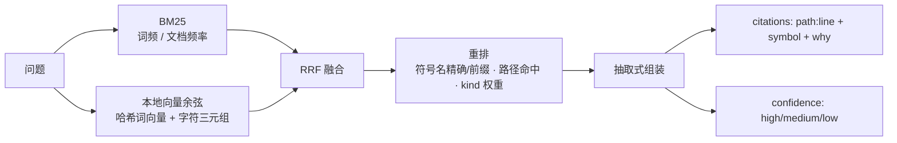
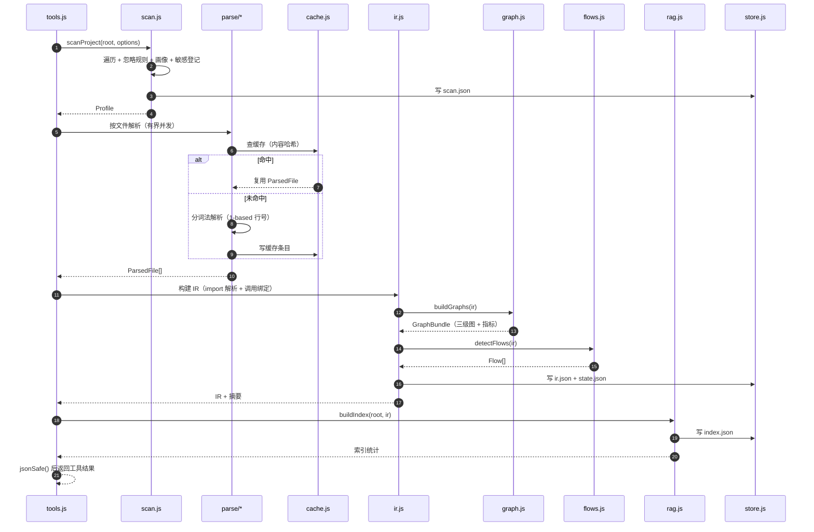
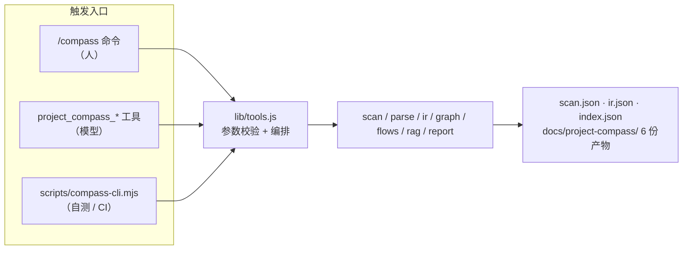
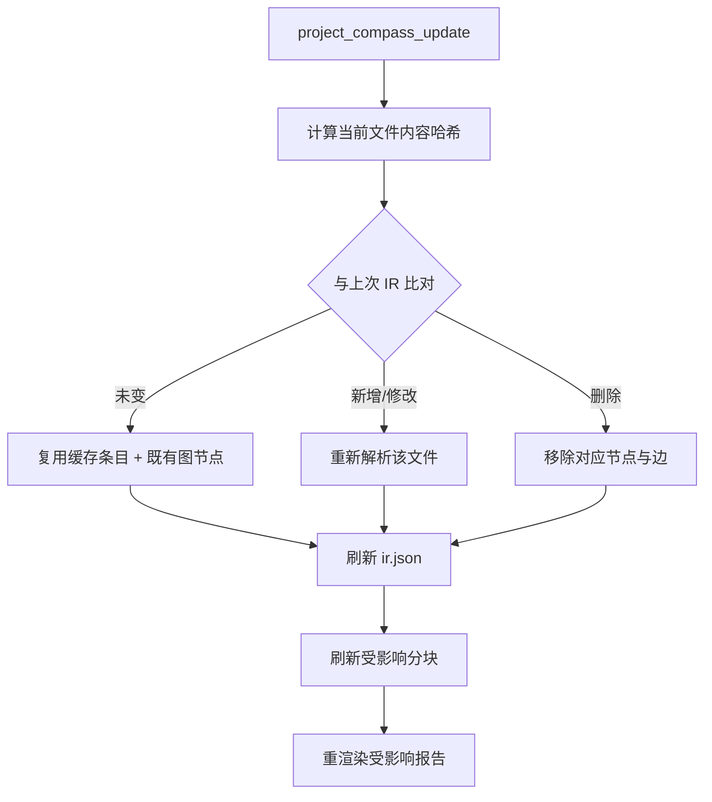

# 架构 / ARCHITECTURE

本文件描述 **Project Compass（项目罗盘）插件自身**的架构：模块分层、每层职责、关键设计取舍、
数据流与扩展点。

> 想看「报告里描述的架构」（也就是被分析项目的架构），见 [OUTPUT-FORMAT.md](OUTPUT-FORMAT.md)。
> 想看接口的唯一真相，见 [INTERNAL-CONTRACTS.md](INTERNAL-CONTRACTS.md)。

- [设计目标与约束](#设计目标与约束)
- [分层总览](#分层总览)
- [模块职责](#模块职责)
  - [L0 基础层：util / paths / store](#l0-基础层util--paths--store)
  - [L1 感知层：scan / parse](#l1-感知层scan--parse)
  - [L2 结构层：analyze / ir / cache / graph / flows](#l2-结构层analyze--ir--cache--graph--flows)
  - [L3 智能层：chunk / embed / rag / llm / validate / insights](#l3-智能层chunk--embed--rag--llm--validate--insights)
  - [L4 交付层：pipeline / report / mermaid / insights / tools / project / skill / index](#l4-交付层pipeline--report--mermaid--insights--tools--project--skill--index)
- [关键设计取舍](#关键设计取舍)
- [数据流](#数据流)
- [扩展点](#扩展点)
- [边界与不变量](#边界与不变量)

---

## 设计目标与约束

| 目标 | 具体含义 |
| --- | --- |
| **零外部依赖** | 只允许 `node:*` 内置模块。没有 npm 依赖，没有构建步骤，克隆即可运行 |
| **宿主无关** | 核心逻辑在任何 Node 进程里都能跑；宿主能力（LLM）只通过 `ctx.get(...)` 可选接入 |
| **确定性优先** | 同样输入 → 同样输出。缓存、diff、CI 门禁都建立在这个性质上 |
| **宁可少报，不可错报** | 行号、符号、路径必须能在 IR 中核对；不确定的一律标 `unresolved` / 「未验证」 |
| **失败不致命** | 单个文件畸形、缓存损坏、缺 LLM 服务都不应让「拿到一份可用画像」这件事失败 |
| **可单测** | 纯计算与 I/O 分离；解析器、检索器、渲染器都是「输入 → 输出」的函数 |

这些目标直接决定了下面的分层：**越靠上的层越"知道业务"，越靠下的层越"什么都不知道"**，
而所有 I/O 集中在少数几个模块里。

---

## 分层总览

```mermaid
flowchart TB
  subgraph L4["L4 交付层"]
    pipeline["pipeline.js（编排）"]
    report["report.js"]
    mermaid["mermaid.js"]
    tools["tools.js"]
    project["project.js"]
    skill["skill.js / SKILL.md"]
    index["index.js（插件入口）"]
  end

  subgraph L3["L3 智能层"]
    chunk["chunk.js"]
    embed["embed.js"]
    rag["rag.js"]
    llm["llm.js"]
    validate["validate.js"]
    insights["insights.js"]
  end

  subgraph L2["L2 结构层"]
    analyze["analyze.js"]
    ir["ir.js"]
    cache["cache.js"]
    graph["graph.js"]
    flows["flows.js"]
  end

  subgraph L1["L1 感知层"]
    scan["scan.js"]
    parse["parse/*.js"]
  end

  subgraph L0["L0 基础层"]
    util["util.js（纯函数，无 import）"]
    paths["paths.js（路径规约）"]
    store["store.js（原子写 / 软失败读）"]
  end

  index --> tools
  index --> skill
  tools --> pipeline
  tools --> project
  pipeline --> report
  pipeline --> insights
  pipeline --> rag
  scan --> parse
  scan --> ir
  ir --> cache & parse & graph & flows
  graph --> util
  flows --> graph
  chunk --> ir
  rag --> chunk
  rag --> embed
  report --> mermaid
  report --> validate
  mermaid --> util
  llm --> validate
  scan --> util
  parse --> util
  ir --> util
  rag --> util
  report --> util
  store --> util
  store --> paths
  tools --> store
  pipeline --> store
  project --> store
```

**依赖方向自上而下单向**：上层可以调下层，下层不知道上层存在。
`util.js` 是最底层——它**不 import 任何东西**（连 `node:path` 都不），因此可以被任何模块安全依赖。

---

## 模块职责

### L0 基础层：util / paths / store

| 模块 | 职责 | 关键点 |
| --- | --- | --- |
| `lib/util.js` | 纯函数工具箱：字符串、集合、并发、标识符分词、glob 编译、内容哈希、JSON 安全化、证据引用、Mermaid 文本安全化 | **零 import、零 I/O、零副作用**。这是它能成为「所有模块的共同前提」的原因 |
| `lib/paths.js` | 全部落盘位置的唯一定义：状态目录、缓存分片、IR / 索引 / 状态 / 问答日志、6 份报告的路径表 | 路径逻辑不许散落各处；改目录结构只改这一个文件 |
| `lib/store.js` | 落盘原语：**原子写**（临时文件 + rename）、**软失败读**（失败返回 fallback）、精确删除、目录统计 | 唯一允许做通用文件 I/O 的地方（与 scan / cache / rag / tools 并列） |

**为什么把 `util.js` 做成「连 node: 都不 import」**：它一旦引入任何模块，就有了加载顺序、平台差异
和 mock 成本。保持它纯函数，意味着它可以用最朴素的 `assert` 单测，也可以在浏览器环境里跑
（Mermaid 文本安全化就受益于此）。`toPosix` / `trimTrailingSlash` 这些看起来像 `node:path`
的活，实际用字符串实现更可控——我们要的是「稳定的 posix 相对路径」，而不是「跟随宿主平台的路径」。

**为什么读写原语必须是「原子写 + 软失败读」**：分析产物是可重建的派生数据。
崩溃时留下半截 JSON 比完全没有更糟（下次读到会解析失败）；而读缓存失败不该让整个分析失败。
所以写侧保证「要么旧、要么新」，读侧保证「读不到就重算」。

### L1 感知层：scan / parse

| 模块 | 职责 | 关键点 |
| --- | --- | --- |
| `lib/scan.js` | 目录遍历、忽略规则求值、语言/框架/入口/命令识别、敏感文件登记、风险信号、工程缺口 | 唯一的「先看全貌」入口；产物是 `Profile` |
| `lib/parse/index.js` | 语言判定与分派、`isDeepLanguage`、统一 `parseFile` 门面 | **永不抛错**：内部异常转成 `notes` |
| `lib/parse/js-ts.js` | TS / JS / TSX / JSX：函数、箭头函数、类、方法、接口、类型、枚举、常量、import/export、调用、Express/Koa/Fastify/NestJS 路由、React 组件 | 深度解析 |
| `lib/parse/python.js` | `def` / `async def` / `class`、`import` / `from ... import`、装饰器路由（Flask/FastAPI/Django）、调用、`__all__` | 深度解析 |
| `lib/parse/java.js` | 类/接口/枚举/注解类型/记录、方法（含构造器）、`package` / `import`、Spring 注解路由、方法调用 | 深度解析 |
| `lib/parse/generic.js` | 其余语言的轻量抽取：顶层声明、import/use/include、TODO | 输出**同构**（形状一致，允许 `symbols` 稀疏） |

**感知层的契约**：解析器**只做词法/结构抽取，不做跨文件解析**。`import './a.js'` 的 specifier
原样保留，由 IR 层负责解析成 fileId。这条边界让解析器可以完全无 I/O、可单测，
也让「跨文件关系」只有一个实现点（IR 层），不会出现两套互相矛盾的解析逻辑。

**定位算法**：行扫描 + 括号/缩进配平，产出 1-based 的 `line` 与 `endLine`，嵌套符号用 `parent`
表达。宁可少报一个符号，也不要给错行号——错行号会污染报告、误导阅读、破坏验证器。

### L2 结构层：analyze / ir / cache / graph / flows

| 模块 | 职责 | 关键点 |
| --- | --- | --- |
| `lib/analyze.js` | 分析流水线：复用画像 → 有界并发解析（带缓存）→ `buildIR` → `buildGraphs` → `detectFlows`，并汇总预算与警告 | 只做编排不做解析；`DEFAULT_BUDGET` 在这里定义 |
| `lib/ir.js` | 把 `ParsedFile[]` 收敛成统一 IR：模块聚合、import specifier → fileId 解析、调用绑定、符号 id 生成、统计与截断标记 | 跨文件关系的**唯一**实现点 |
| `lib/cache.js` | 内容哈希缓存：按文件存解析结果，命中即复用；变更检测 | 增量的全部秘密就在这里 |
| `lib/graph.js` | 模块/文件/符号三级图；扇入扇出、枢纽、孤儿、入口可达性、循环检测、风险评分 | 纯计算，无 I/O |
| `lib/flows.js` | 从 HTTP 路由 / CLI / 事件入口出发抽取关键链路；`flowDiagram` 生成 Mermaid 时序图 | 每条链路都带 `confidence` 和证据 |

**调用绑定只允许四种结论**（这是全插件唯一允许"猜"的地方，而且必须记录猜测方式）：

| `resolution` | 规则 | `toSymbolId` |
| --- | --- | --- |
| `same-file` | 同名符号在本文件内唯一 | 该符号 |
| `import` | 本文件 import 的 `names` 含该名，且目标文件内同名符号唯一 | 该符号 |
| `global` | 内置/宿主全局（`console.log`、`JSON.parse`、`print`、`len`…） | `null` |
| `unresolved` | 其余一切 | `null` |

**为什么要把 `resolution` 落盘**：图上的每条边都要能被追问「你凭什么连这条线」。
有了 `resolution`，报告就能诚实地说「这条边是同文件同名绑定」而不是假装它是精确的调用图。
这也让 `unresolved` 的规模成为一个可观测指标——它大，说明这个项目用了大量动态派发或别名，
此时报告的置信度就该下调。

### L3 智能层：chunk / embed / rag / llm / validate / insights

| 模块 | 职责 | 关键点 |
| --- | --- | --- |
| `lib/chunk.js` | 把 IR 切成可检索分块：按符号切、文件头、配置、文档 | 分块边界与符号边界对齐，引用才能落到具体符号 |
| `lib/embed.js` | **确定性本地向量**：哈希词向量 + 字符三元组，L2 归一化；`cosine`、`embedDerived`（可 JSON 落盘） | 无模型文件、无网络、可复现 |
| `lib/rag.js` | 建索引、纯函数检索、抽取式问答、索引统计 | 检索是纯函数，因此可以脱离 I/O 单测 |
| `lib/llm.js` | `createLlmClient(ctx, config)`：可用性探测、`describe()`、`complete()` | 拿不到宿主 LLM 服务即 `available() === false`，调用方必须降级 |
| `lib/validate.js` | 对 LLM / 叙述性文本做结构性校验：路径存在于 IR？行号在 `1..loc`？符号能找到？ | **验证不过就丢弃**，并给出丢弃条数 |
| `lib/insights.js` | 洞察层：确定性半边（阅读顺序、风险汇总、角色路线）与 LLM 半边（叙事生成）严格分开 | LLM 只被允许「用给定事实写措辞」，输出必须是带引用的结构化断言并逐条过验证器 |

检索流水线：



**为什么向量要用「哈希词向量 + 字符三元组」而不是真嵌入模型**：

1. **零依赖**——真模型要么需要 npm 包，要么需要下载权重文件，两条都违反硬约束；
2. **可复现**——同一段文本永远得到同一个向量，索引可以落盘、可以 diff、可以被缓存；
3. **离线可用**——不联网、不下载、不受 provider 波动影响；
4. **够用**——项目内问答的召回主要靠符号名与路径（BM25 的强项），向量只用来补
   「同义改写、命名不同、注释式提问」这一类模糊匹配。

代价是语义泛化能力弱于真嵌入模型。这是自觉的取舍，远程嵌入在 [ROADMAP.md](ROADMAP.md) 里。

### L4 交付层：pipeline / report / mermaid / insights / tools / project / skill / index

| 模块 | 职责 | 关键点 |
| --- | --- | --- |
| `lib/pipeline.js` | 产物编排：把 IR / 图谱 / 洞察变成磁盘上的 6 份报告，以及本地 RAG 索引与问答 | **CLI 与 DSH 工具走同一条路径**，避免「命令行能跑、工具里跑不通」的双实现漂移 |
| `lib/report.js` | 渲染 6 份产物；角色路线（backend/frontend/test/devops/data）；`roleCatalogue` | 确定性渲染，可 diff；渲染层**绝不抛错**，失败段落降级为「数据不足」 |
| `lib/mermaid.js` | 模块图、文件图、流程图、架构图、时序图 | 所有标签过安全化与长度截断，超限即裁剪并标注 |
| `lib/tools.js` | 6 个工具的定义与实现，**唯一负责入参校验与抛错** | 返回值保持摘要体积；参数校验集中在 `asString` / `asInt` / `asBool` 等助手 |
| `lib/project.js` | 项目状态读写：画像 / IR / 状态文件的加载与保存，收敛所有路径拼接 | 读取一律软失败：状态缺失意味着「还没分析过」，不是错误 |
| `lib/skill.js` + `lib/SKILL.md` | 可选的方法论 skill（工作流、判断纪律、反模式） | 正文在 `SKILL.md`，装后可改；宿主没有 `skills` 服务时跳过注册，工具照常工作 |
| `lib/index.js` | 插件入口：**只有命名导出** `name` / `inject` / `apply`；注册 6 个工具与 `/compass` 命令 | 不允许 default export（见下）；`inject: ['tools']` |

**为什么插件入口不能有 default export**：Loader 的 `unwrapExports` 会把 default 折叠掉，
连带丢掉 `inject`——插件看起来加载成功了，但依赖注入没生效，表现为「工具不在」。
这是一个很难排查的失败模式，所以把它写成硬约束（契约 §0.3）。

**为什么 `tools.js` 独占"抛错权"**：契约把「入参非法」与「内部异常」分开处理。
入参非法要让人看见（报错），内部异常要让人拿到结果（降级 + `warnings`）。
把抛错集中在一个地方，就不会出现某个深层模块因为一个畸形文件把整个工具调用搞崩的情况。

---

## 关键设计取舍

### 为什么零依赖

| 收益 | 说明 |
| --- | --- |
| 安装即用 | 没有 install 步骤、没有构建产物、没有原生模块编译 |
| 不可被拖垮 | 宿主升级、锁文件冲突、npm registry 故障都不会影响本插件 |
| 供应链面为零 | 没有第三方代码在你项目里运行，安全评审成本极低 |
| 调试简单 | 栈里全是自己的代码，没有中间层 |

代价是很多能力要自己实现：glob 编译器、BM25、向量、并发池、原子写。
这些都在 `lib/util.js` / `lib/rag.js` / `lib/store.js` 里，规模可控且都能单测。
换取的是「这个插件在任何时候、任何机器上都能跑起来」——对开发工具来说，这个交换是划算的。

### 为什么不用 tree-sitter

> **与需求原文的偏差（FR2）**：需求原文要求用 Tree-sitter 解析 TS/JS、Python、Java。
> 本插件在「零外部依赖」硬约束下**没有采用它**，改为自研的零依赖词法 / 结构抽取器。
> 语言覆盖范围不变，但拿不到真正的语法树——这是本版本对 FR2 的已知偏差，
> 已在 [README 的能力矩阵](../README.md#能力矩阵)与 [ROADMAP](ROADMAP.md) 中如实标注。

tree-sitter 能给出语法级 AST，理论上更准。不采用的原因：

1. **需要原生模块**——引入编译步骤与平台二进制，直接破坏「克隆即用」与「零依赖」；
2. **需要按语言准备语法包**——每加一门语言就要多一个依赖，扩展成本与依赖面同时上升；
3. **本插件要的信息其实很浅**——符号名、行号、import 字符串、调用名、路由注解。
   这些是**词法级 + 局部结构**信息，行扫描 + 括号/缩进配平足以拿到，而且不会因为语法版本
   不匹配而整体解析失败；
4. **容错更好**——真实仓库里常有半截代码、生成代码、非标准方言。基于行的扫描对畸形输入
   天然宽容（拿不到就少报），而严格解析器会整文件失败。

**代价**：拿不到真正的语法树，因此做不到类型推断、重载解析、泛型消解。
我们的定位是「读懂结构并诚实标注不确定」，不是「编译前端」。
真 AST 与 tree-sitter 可选接入都放在 [ROADMAP.md](ROADMAP.md) 里。

### 为什么 LLM 默认关闭

1. **隐私**——本插件读的是**用户的代码**。默认把代码片段发给模型，是替用户做了一个他没做的决定；
2. **必要性**——事实、依赖图、关键链路、证据引用全部来自确定性算法。
   LLM 只负责「叙述得更顺」，去掉它不会让报告失去事实；
3. **可验证性**——确定性输出可以被 diff、被缓存、被 CI 断言。LLM 输出不行，
   因此它必须被隔离在「可选增强」这一层，并且**必经验证器**；
4. **成本与可控性**——`maxCalls` / `maxTokens` 是硬上限，默认关闭意味着默认零成本、零延迟。

打开后也有一条硬规则：**验证不过的声明一律丢弃并计数**。
这让「LLM 说了什么」永远不会直接变成报告里的断言。

### 为什么状态目录与产物目录分离

| 目录 | 性质 | 生命周期 | 进版本库 |
| --- | --- | --- | --- |
| `.project-compass/` | 机器状态（派生数据） | 可随时删除重建 | 否 |
| `docs/project-compass/` | 人类产物（团队资产） | 应随代码演进、被评审 | 是 |

如果混在一起，会同时出现两个问题：清缓存时顺手删掉团队文档；
以及「文档」被当成缓存反复覆盖，没人把它当交付物。
分离之后，两个目录的运维方式可以完全不同：缓存随便删，文档按 PR 评审。
另外，`.project-compass/` 自身也在默认忽略规则里——分析产物不该被自己的分析再分析一遍。

---

## 数据流

### 一次 `analyze` 的完整链路



### 三种触发方式共享同一条链路



三条入口复用同一套实现，因此 CLI 可以当作回归测试通道，命令与工具不会有行为差异。
唯一的差异是：CLI 不经过 DSH 宿主，因此拿不到 LLM 服务，走「宿主无 LLM」降级路径。

### 增量更新的数据流



增量只对**变化文件**做解析，但图与流程需要重新求值（图的算法本身是廉价的纯计算）。
因此 `update` 的成本大致正比于「改了多少文件」，而不是仓库大小。

---

## 扩展点

### 如何加一门语言

目标：让 `foo` 语言拿到与 TS / Python / Java 同级的解析能力。

**步骤**

1. **新建解析器** `lib/parse/foo.js`，实现契约里的 `ParsedFile` 形状：

   ```js
   // lib/parse/foo.js
   export function parseFoo(input) {
     // input: { relPath, content, language, fileId, moduleId }
     return {
       language: 'foo',
       symbols: [],   // { name, kind, line, endLine, exported, parent, signature, doc }
       imports: [],   // { specifier, line, names, kind }
       calls: [],     // { calleeName, line, fromSymbolName, kind, receiver }
       routes: [],    // { method, path, line, handlerName, framework, middlewares }
       exports: [],
       todos: [],     // { line, text, kind }
       notes: [],     // 降级/异常说明
     }
   }
   ```

   **硬性要求**：
   - **永不抛错**——任何异常都要转成 `notes`，不能让一个文件搞崩整次分析；
   - **行号 1-based 且正确**——宁可少报符号，不可错行；
   - **不做跨文件解析**——`specifier` 原样保留，交给 IR 层；
   - 嵌套符号用 `parent`（父符号名）表达。

2. **注册语言**：在 `lib/parse/index.js` 的 `SUPPORTED_LANGUAGES` 里加上语言名，
   在 `detectLanguage` 里加扩展名 / 文件名映射，在 `parseFile` 的分派里接上 `parseFoo`。

3. **标记深度**：如果你希望它走深度路径（而不是 `generic.js` 的轻量抽取），
   把它加入 `isDeepLanguage`。

4. **补测试** `test/parse.test.js`（或你负责的测试文件）：至少覆盖
   - 一个正常文件：符号名 + 行号 + 导出；
   - 一个畸形文件（括号不配平、半截代码）：不抛错，有 `notes`；
   - import / 调用 / 路由各一条；
   - 行号断言（这是最容易错也最该守的地方）。

5. **跑通**：

   ```bash
   node --test
   node scripts/compass-cli.mjs analyze <一个含该语言的真实项目>
   ```

**如果只是想让某门语言"至少被看见"**：不用写解析器，在 `detectLanguage` 里把它映射到一个
已有语言或 `text`，`generic.js` 会做轻量抽取（顶层声明、import/use/include、TODO）。
这是低成本接入路径，产物形状与深度解析一致，只是 `symbols` 更稀疏。

### 如何加一个报告章节

目标：在 `ARCHITECTURE.md`（或任意报告）里加一节。

**步骤**

1. 在 `lib/report.js` 的渲染函数里找到对应报告的分节位置；
2. 写一个只依赖 `model`（`{ ir, profile, graph, flows, insights, meta }`）的纯函数返回 Markdown 字符串：

   ```js
   function renderMySection(model) {
     const rows = (model.graph?.metrics?.hubs ?? [])
       .slice(0, 10)
       .map((h) => `| \`${h.id}\` | ${h.fanIn} | ${h.fanOut} |`)
     if (rows.length === 0) return ''   // 没数据就不要渲染空章节
     return ['## 我的新章节', '', '| 模块 | 扇入 | 扇出 |', '| --- | --- | --- |', ...rows, ''].join('\n')
   }
   ```

3. **必须遵守的规则**：
   - **每条结论后附证据** `path:line`，用 `util.cite()` 生成，不要手拼字符串；
   - **无证据的推断显式标注「未验证」**；
   - 没数据时返回空字符串（宁可不出现，也不要出现空章节）；
   - 涉及的 Mermaid 图交给 `lib/mermaid.js`，不要自己拼图语法（标签安全化在那里）；
   - 用 `util.mermaidSafe()` 处理任何进入图的用户数据。

4. **加图表时**：在 `lib/mermaid.js` 里加函数，同样遵守「标签安全化 + 节点上限 + 裁剪标注」。

5. **补测试** `test/report.test.js`：
   - 章节出现在输出里；
   - 空数据时章节不出现；
   - 每条断言行都能匹配到 `path:line` 形式。

6. **不要破坏确定性**：不要引入时间戳、随机顺序、`Object.keys` 的隐式顺序依赖；
   需要排序就显式 `sortBy`。

### 其他可扩展点

| 想改什么 | 改哪里 | 注意 |
| --- | --- | --- |
| 忽略规则默认集 | `lib/scan.js` 的默认规则函数 | 同时更新 [CONFIG.md](CONFIG.md#忽略规则的匹配语义) |
| 敏感文件清单 | `lib/scan.js` 的敏感判定 | **只登记不读内容**这条红线不能破；同步更新 [CONFIG.md](CONFIG.md#敏感文件默认清单) |
| 风险评分权重 | `lib/graph.js` | 评分理由（`reasons`）必须与权重变化一起更新，报告里要能解释分数 |
| 检索策略 | `lib/rag.js` / `lib/embed.js` | 保持 `searchIndex` 为纯函数，否则无法单测 |
| 报告角色 | `lib/report.js` 的 `roleCatalogue` | 新角色的路线要有可执行的步骤与 `path:line` |
| 工具参数 | `lib/tools.js` | 同步更新 [TOOLS.md](TOOLS.md)；参数校验集中在 `tools.js` |
| 新增工具 | `lib/tools.js` + `lib/index.js` 注册 | 工具返回前必须过 `jsonSafe` |

---

## 边界与不变量

这些性质是架构的一部分，改动它们等于改变产品承诺：

1. **`lib/util.js` 不 import 任何东西**——它是所有模块的公共地基；
2. **解析器不做 I/O、不抛错、不做跨文件解析**；
3. **跨文件关系只在 `lib/ir.js` 里解析**，且调用绑定必须记录 `resolution`；
4. **敏感路径只 `stat`，永不 `read`**——这条在 `scan.js` 与 `cache.js` 两侧都要守；
5. **只有 `lib/tools.js` 因为入参非法而抛错**，其余模块一律降级 + `warnings`；
6. **插件入口只有命名导出**，没有 `export default`；
7. **所有写入原子化**，所有读取软失败；
8. **报告里的每个 `path` / `line` / `symbol` 都能在 IR 中核对**，否则被验证器丢弃；
9. **默认不发起任何网络请求**，LLM 必须显式开启且必经验证器；
10. **渲染是确定性的**，同样输入得到同样字节（生成时间除外）。

任何一条被破坏，都应该在代码评审里被拦下——它们不是风格偏好，而是这份架构之所以成立的支点。
